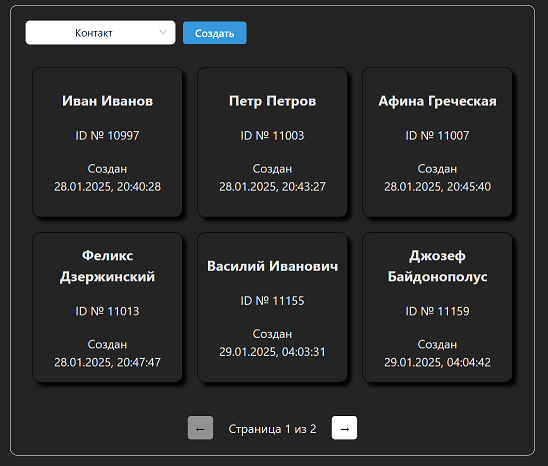
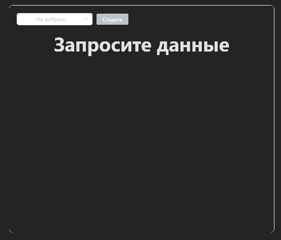
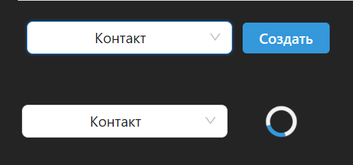

# Тестовое Генезис

1. Необходимо запустить и возможно, если мой тестовой аккаует не отключат, настроить сервер ***amo-widget-server-main***, который организует получение AccessToken без необходимости иметь действующий сайт в сети. Ссылка на репозиторий с инструкцией [https://github.com/antirek/amo-widget-server]. От себя добавил маршрут ***/token*** для получения AccessToken с сервера. Для работы необходим порт 3000. 
> Запуск: yarn start:server

2. Сервер для фронтенда. Nest, TypeScript. Для работы необходим порт 5000. 
> Запуск: yarn start:dev

3. Фронтенд. Vue3, Pinia, AntDesign, Axios, TypeScript. Для работы необходим порт 5173
> Запуск: yarn dev

# Результат работы приложения
 
# Старт приложения
 
# Состояния кнопок
 
